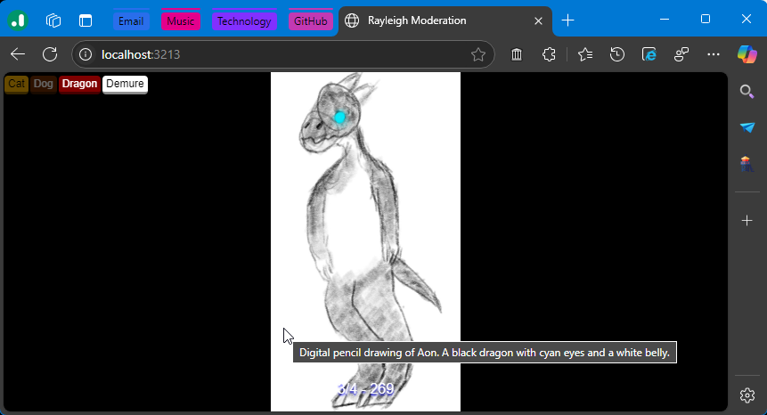

# Rayleigh Moderation
Moderation interface for quickly labeling `app.bsky.feed.post` records containing images and videos. Live at https://rayleigh.bunnynabbit.com/.

Rayleigh is not a replacement labeling service. It still requires a labeling service like [Ozone](https://github.com/bluesky-social/ozone/) to function.

## Setup
Node.js should be installed prior to following these setup instructions.
1. In the project directory, install dependencies with `npm i`.
2. Copy `/example.env` to `/.env`. You will then edit the new files with relevant information.
3. Run `npm run build` to build the web interface. Or use `npm run watch` to build on changed files. 
4. Run with `npm run start`. By default, the moderation interface can be accessed at port 3213. You may need to either deploy Rayleigh or use tunneling software to login.

## Configure
Rayleigh requires an account and a Ozone-based labeler to be used. Set up an account by clicking on the `Configuration` button and then add your handle and labeler DID in the `Handle` and `Labeler DID` boxes respectively. Refresh the page and go through the Oauth login process.

For triage, only acknowledging/escalating posts will be available. If moderating, add the labels you plan to apply by pressing the `Add` button. `Label slug` is the internal name of the label.

Depending on your connection speed and computation power of your device, you may need to adjust the `Posts to preload`, `Queue pages` and `Back queue size` options.
- `Posts to preload`: The number of posts to preload. Videos may be resource intensive.
- `Queue pages`: The number of pages to load from a report queue. one page = 100 posts.
- `Back queue size`: The number of posts to keep in the back queue before being discarded. Kept videos inside the back queue may be resource intensive.

`Queue` is the Ozone queue used for populating reports from. The value of `reported` is the report queue which can contain user created reports. `escalated` are posts which were escalated by a moderator. It may be suitable to use "Single post labeling" for labeling the `escalated` queue and use "Multiple post escalation" for escalating posts from the `reported` queue.
## Usage
The interface will emit events back to the labeling service when a post is acknowledged/labeled. Set a post's labels from the buttons on the top left area of the interface

Keyboard: Left-right arrow keys to switch image in post and Enter to acknowledge/label. Label access keys may be implemented differently on browsers, but this is typically `Alt+KEY`. Backspace to show previously seen post.

Touch gestures: Swipe left-right to switch image in post and up to acknowledge/label. Swipe down to show previously seen post.
